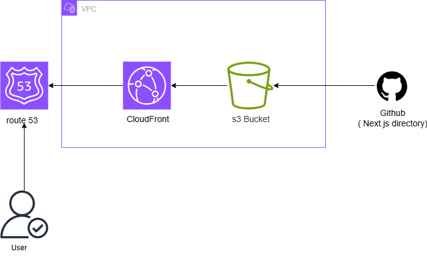

```

# Terraform Next.js Portfolio Project

## Project Overview
I deployed a responsive, single-page Next.js portfolio website on AWS using Infrastructure as 
Code (IaC) with Terraform, ensuring scalability, reliability, and high performance.

## Requirements
The website must be:

- Highly Available: Accessible worldwide with minimal downtime  
- Scalable: Handle increasing traffic without performance issues  
- Cost-Effective: Optimized hosting costs  
- Fast Loading: Quick load times for global visitors  

## Project Setup

### 1.1 Create GitHub Repository
1 Create a new repository named `terraform-portfolio-project`  
2 Initialize with a README file  
3 Clone the repository:

git clone git@github.com:Godwin-svg/terraform-portfolio-project.git

## 1.2 Clone Next.js Portfolio Starter Kit

1 Create the Next.js project:
npx create-next-app@latest nextjs-blog --use-npm --example "https://github.com/vercel/next-learn/tree/main/basics/learn-starter"
2 Navigate and start the development server:
cd nextjs-blog
npm run dev
3 Access the app at http://localhost:3000


 1.3 Configure Next.js for Static Export
1 In the project root, create next.config.js: 
/**
 * @type {import('next').NextConfig} 
 */
const nextConfig = {
  output: 'export',
}
module.exports = nextConfig
```
2 Build the project:
npm run build
This generates a static version of the app in the out folder.
3 Push to GitHub:
git add .
git commit -m "Next.js project created"
git push
```
## Terraform Configuration
### 1.4 Set Up Project Directory
1 mkdir terraform-nextjs
cd terraform-nextjs
touch provider.tf state.tf 

## provider.tf
Contains AWS provider configuration:
terraform {
  required_providers {
    aws = {
      source  = "hashicorp/aws"
      version = "~> 6.0"
    }
  }
}
provider "aws" {
  region  = "us-east-1"
  profile = "dev"
}

## state.tf
Configures remote backend for Terraform state:
terraform {
  backend "s3" {
    bucket         = "inno-terraform-remote-state"
    key            = "s3/terraform.tfstate"
    region         = "us-east-1"
    profile        = "dev"
    dynamodb_table = "terraform-state-lock"
  }
}

2 Initialize and Apply Terraform
terraform fmt
terraform init

- created the maint.tf file
  ## touch main.tf
  Defines the main infrastructure resources, including S3, CloudFront, and bucket policies
# create s3 bucket
resource "aws_s3_bucket" "website" {
  bucket = "inno-123-nextjs-website-bucket"

  tags = {
    Name = "inno-123-nextjs-website-bucket"
  }

}

# s3 bucket website configuration
resource "aws_s3_bucket_website_configuration" "website-config" {
  bucket = aws_s3_bucket.website.id

  index_document {
    suffix = "index.html"
  }

  error_document {
    key = "error.html"
  }

}

# bucket ownership control
resource "aws_s3_bucket_ownership_controls" "bucket-ownership-controls" {
  bucket = aws_s3_bucket.website.id

  rule {
    object_ownership = "BucketOwnerPreferred"
  }

}

# allow bucket public access 
resource "aws_s3_bucket_public_access_block" "allow-public-access" {
  bucket = aws_s3_bucket.website.id

  block_public_acls       = false
  block_public_policy     = false
  ignore_public_acls      = false
  restrict_public_buckets = false

}

# bucket acl
resource "aws_s3_bucket_acl" "bucket-acl" {
  bucket = aws_s3_bucket.website.id

  depends_on = [aws_s3_bucket_ownership_controls.bucket-ownership-controls, aws_s3_bucket_public_access_block.allow-public-access]

  acl = "public-read"

}

# s3 policy
resource "aws_s3_bucket_policy" "website_policy" {
  bucket = aws_s3_bucket.website.id

  policy = jsonencode({
    Version = "2012-10-17"
    Statement = [
      {
        Effect    = "Allow"
        Principal = "*"
        Action    = "s3:GetObject"
        Resource  = "${aws_s3_bucket.website.arn}/*"
      }
    ]
  })

}

# Origin Access Identity
resource "aws_cloudfront_origin_access_identity" "origin_access_identity" {
    comment = "OIA for Next.js portfolio site"
  
}

# cloudfront distribution
# CloudFront distribution
resource "aws_cloudfront_distribution" "nextjs_distribution" {
  origin {
    domain_name = aws_s3_bucket.website.bucket_regional_domain_name
    origin_id   = "inno-s3-nextjs-portfolio-bucket"

    s3_origin_config {
      origin_access_identity = aws_cloudfront_origin_access_identity.origin_access_identity.cloudfront_access_identity_path
    }
  }

  enabled             = true
  is_ipv6_enabled     = true
  comment             = "Next.js portfolio site"
  default_root_object = "index.html"

  default_cache_behavior {
    allowed_methods  = ["GET", "HEAD", "OPTIONS"]
    cached_methods   = ["GET", "HEAD"]
    target_origin_id = "inno-s3-nextjs-portfolio-bucket"

    forwarded_values {
      query_string = false
      cookies {
        forward = "none"
      }
    }

    viewer_protocol_policy = "redirect-to-https"
    min_ttl                = 0
    default_ttl            = 3600
    max_ttl                = 86400
    compress               = true
  }

  restrictions {
    geo_restriction {
      restriction_type = "none"
      
    }
  }

  viewer_certificate {
    cloudfront_default_certificate = true
  }
}
  
### 2. Deployed the Infrastructure
terraform fmt
terraform init
terraform plan
terraform apply

### 3. Upload Next.js Static Site to S3
aws s3 sync ./out s3://inno-123-nextjs-website-bucket --profile dev

### 4. Configure Route 53 Subdomain
1 Created subdomain: nextjs.godwintechservices.com
2 Routed CloudFront distribution domain d17zemop2xencq.cloudfront.net to the subdomain

### 5. Access the Website
The website was accessible at https://nextjs.godwintechservices.com
It is no longer available as the infrastructure has been destroyed

.

### 6 Destroy Resources
terraform destroy

```


 
